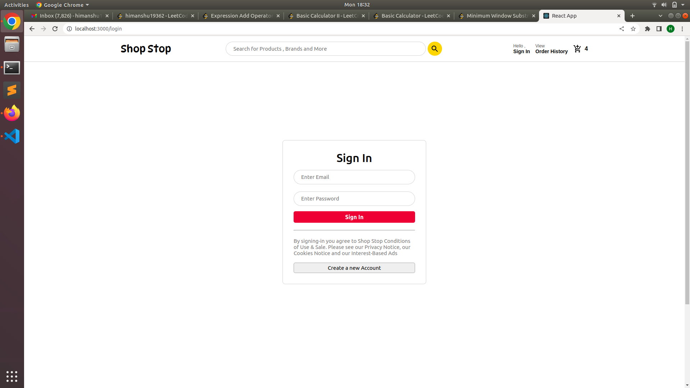

# Shop Stop

This is a E commerce website for ordering groceries created using ReactJS.  

## Youtube 

[Link](https://www.youtube.com/watch?v=ExYoLT8dL5o) to Youtube Video

## Installation

1) Clone the Repository.
2) Run command `cd shop-stop`
3) Run command `npm start`

## Images

